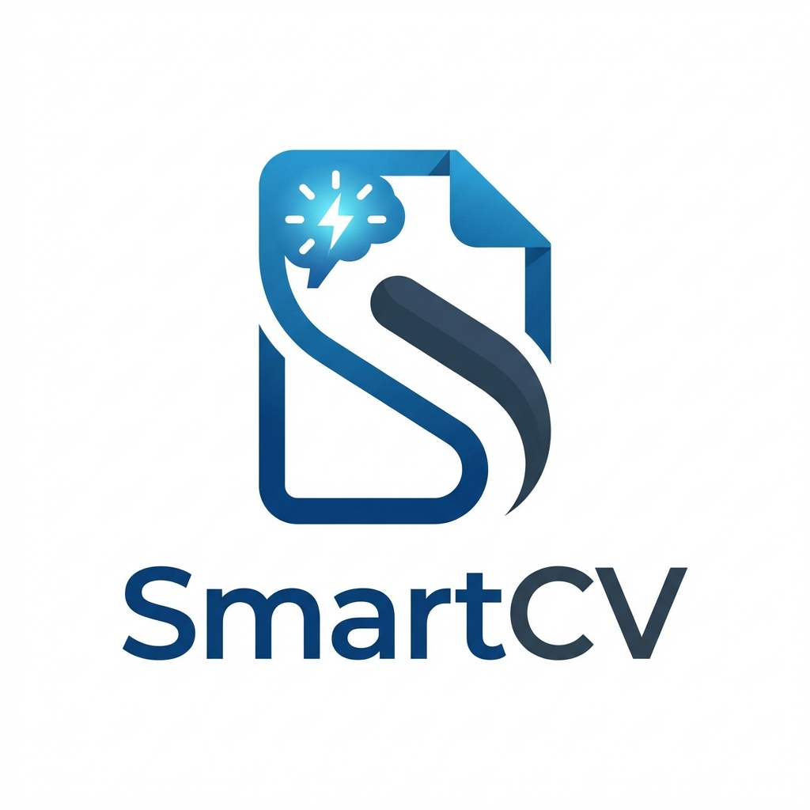

# SmartCV Elite - RPA & AI Mobile Masterpiece

## 🚀 O Futuro Recrutamento de Elite

O **SmartCV Elite** não é apenas um criador de currículos; é uma plataforma sofisticada de RPA (Robotic Process Automation) e Inteligência Artificial projetada para elevar seu perfil profissional ao patamar das grandes multinacionais.

### ✨ Funcionalidades Premium
- **Interface Elite UI/UX**: Design inspirado nas maiores big techs do mundo, com foco em simplicidade, elegância e performance.
- **Consultoria IA Sofisticada**: Integrado com Google Gemini Pro para otimização em tempo real de resumos, experiências e habilidades.
- **Dual-Storage System**: Persistência local robusta com SQLite para testes e rascunhos, pronto para escalabilidade em nuvem (Supabase).
- **Masterpiece Creator**: Fluxo de criação passo a passo otimizado para dispositivos móveis (Android/iOS).
- **Elite Chat IA**: Um consultor de carreira disponível 24/7 para tirar suas dúvidas e sugerir melhorias.

### 🛠️ Stacks Tecnológicas
- **Frontend**: React Native + Expo SDK 54.
- **Estilização**: NativeWind (Tailwind CSS) + Lucide Icons.
- **Motor de IA**: Google Generative AI (Gemini Pro API).
- **Banco de Dados**: SQLite (Core) & Prontidão para PostgreSQL.
- **Navegação**: Expo Router (File-based navigation).

### 📖 Como Começar
1. Instale as dependências: `npm install`
2. Inicie o servidor Expo: `npx expo start`
3. Escaneie o QR Code com o app **Expo Go** no seu Android ou iOS.

---
Desenvolvido com excelência por **Shinzo Suzuki Filho**.
